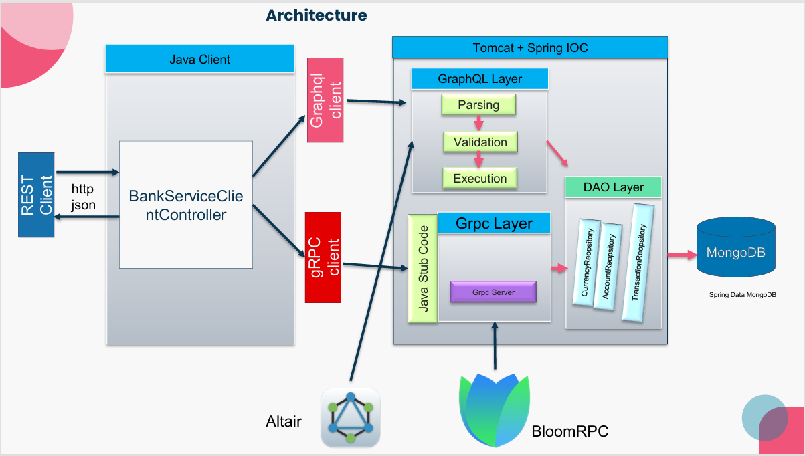

# gRPC and GraphQL Banking Service Demo

A comparative study and demonstration project exploring modern backend communication technologies using:

- gRPC
- GraphQL
- Spring Boot
- MongoDB
- Protocol Buffers

The project demonstrates the architecture, communication models, and strengths of both technologies through a banking service example.

The goal of this project is not to build a complete banking application, but rather to study and compare modern API communication approaches in distributed systems.

---

# Project Overview

This project implements two communication layers:

- GraphQL Layer
- gRPC Layer

Both layers interact with the same backend business logic and MongoDB persistence layer.

The project demonstrates:

- GraphQL queries and mutations
- gRPC unary communication
- gRPC streaming
- protobuf serialization
- distributed backend communication
- DTO and entity mapping
- client/server interaction

The services are tested using:

- Altair GraphQL Client
- BloomRPC
- browser-based REST demonstration endpoints

---

# Architecture

The system contains:

- Java demonstration client
- GraphQL server
- gRPC server
- MongoDB persistence layer
- generated protobuf stubs
- Spring Boot backend services

The architecture demonstrates how modern backend systems communicate using different protocols and serialization techniques.

---

# Architecture Diagram



---

# Technologies Used

## Backend

- Java
- Spring Boot
- Spring GraphQL
- gRPC
- Protocol Buffers (protobuf)
- Spring Data MongoDB
- MongoDB
- Maven

---

## Client & Testing

- Java REST Client
- Altair GraphQL Client
- BloomRPC

---

# Features

## GraphQL Features

- flexible query structure
- selective data fetching
- schema-driven API
- account creation
- account updates
- currency conversion
- reduced over-fetching

---

## gRPC Features

- high-performance communication
- protobuf serialization
- unary RPC calls
- server streaming
- generated Java stubs
- asynchronous communication

---

# Banking Domain

The banking domain is used as a demonstration scenario for both technologies.

The system manages:

- bank accounts
- currencies
- transactions

Examples include:

- account creation
- account retrieval
- transaction retrieval
- currency conversion

---

# GraphQL Layer

The GraphQL implementation demonstrates:

- query parsing
- validation
- execution
- mutation handling
- selective response fetching

GraphQL endpoints can be tested using:

```text id="y4lb7k"
Altair GraphQL Client
or Java REST Client(exemple : http://localhost:8082/qql/accounts)
```

---

# gRPC Layer

The gRPC implementation demonstrates:

- unary communication
- server streaming
- protobuf serialization
- generated service stubs
- asynchronous communication
- different communications modes are implemented

Here is communication methodes of grpc : 


The project uses generated protobuf Java classes and service stubs.

gRPC services can be tested using:

```text id="3g1tmo"
BloomRPC
or Java REST Client(exemple : http://localhost:8082/grpc/accounts/6835d132cdb8cf8ecdedb332)
```

---

# MongoDB Persistence

MongoDB is used as the database layer.

The persistence layer stores:

- accounts
- currencies
- transactions

using Spring Data MongoDB repositories.

---

# Protocol Buffers

The gRPC communication is based on Protocol Buffers.

The `.proto` file generates:

- request objects
- response objects
- enums
- Java stubs
- gRPC service definitions

Examples include:

- `CreateAccountRequest`
- `ConvertCurrencyRequest`
- `BankAccount`
- `Transaction`

---

# Client Demonstration

The client module demonstrates:

- GraphQL consumption
- gRPC communication
- REST-to-gRPC interaction
- generated stub usage
- protobuf object mapping

The client is used mainly for:

- endpoint testing
- service demonstration
- communication experiments

---

# Educational Purpose

This project was developed as part of a university study project focused on:

- distributed systems
- backend architectures
- API communication technologies
- GraphQL
- gRPC
- REST
- microservice communication

The project compares both technologies(GraphQL and gRPC) in practical backend scenarios and demonstrates their advantages and use cases.

---

# Concepts Explored

- GraphQL
- gRPC
- Protocol Buffers
- Distributed Systems
- Microservices
- Backend Communication
- Streaming Communication
- DTO Mapping
- Spring Boot
- MongoDB

---

# Author

Kalil Sacko

Master Student in Computer Science  
University of Applied Sciences Bochum(Hochschule Bochum)

---

# Notes

- The project focuses on backend communication technologies rather than frontend development.
- The banking domain is used purely as a demonstration scenario.
- Both GraphQL and gRPC are implemented in the same ecosystem for comparison purposes.
- The project demonstrates practical communication patterns used in modern distributed systems.
